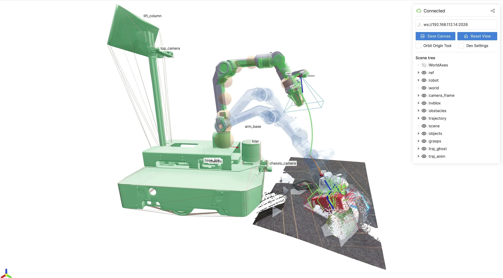
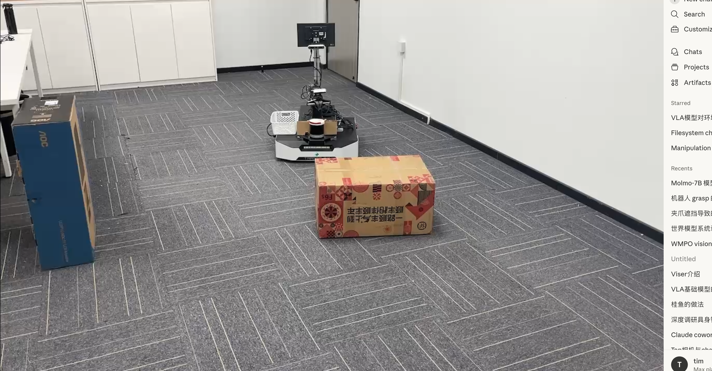
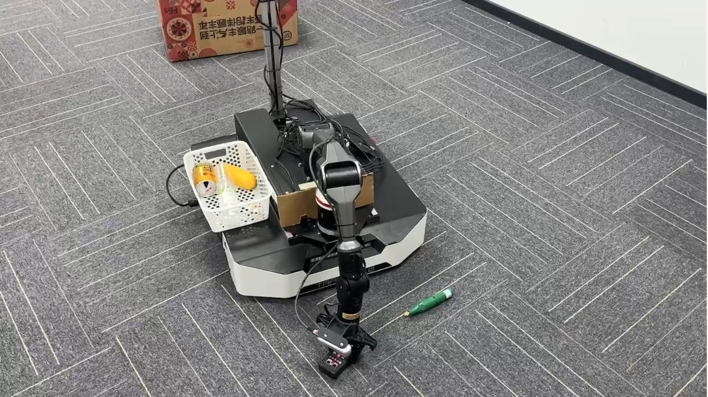
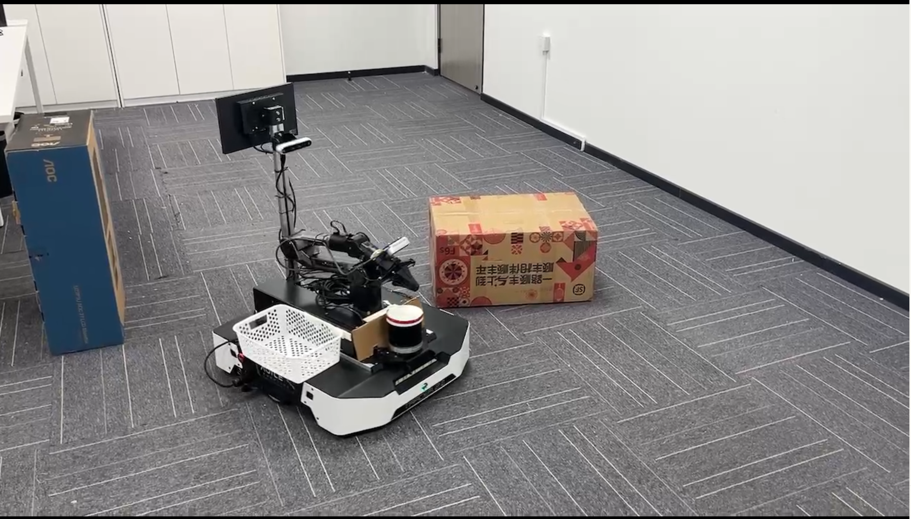

<div align="center">

# MobileManipulator2

**Autonomous Mobile Manipulation on ROS2 Humble · NVIDIA Jetson Orin**

[](https://docs.ros.org/en/humble/)
[](https://www.nvidia.com/en-us/autonomous-machines/embedded-systems/jetson-orin/)
[](https://developer.nvidia.com/embedded/jetson-agx-orin)
[](LICENSE)
[](https://colcon.readthedocs.io/)

*A production-grade autonomous mobile manipulation system integrating 3-layer LiDAR localization, vision-language perception, and 6-DOF grasping in a unified state-machine orchestration framework.*

[中文文档](README_zh.md) · [Architecture](docs/navigation_slam_architecture.md) · [Pick & Place Design](docs/pick_navigator_design.md)

</div>

---

## Demo

<video src="demo/robot_grasp_anni.mp4" controls width="100%"></video>

| Robot Model (URDF) | System Startup |
|---|---|
|  |  |

| Obstacle Avoidance | Grasping |
|---|---|
|  |  |

---

## Overview

MobileManipulator2 is a complete autonomous pick-and-place system designed for unstructured indoor environments. It combines a differential-drive mobile base with a 6-DOF robotic arm, multi-modal sensors, and a layered software stack to autonomously detect, navigate to, and grasp target objects specified by natural language prompts.

```
"bottle.cup.box"  →  detect  →  navigate  →  approach  →  grasp  →  place
```

The system runs entirely on an NVIDIA Jetson Orin (ARM64) without any external compute.

---

## Key Features

| Category | Capability |
|----------|-----------|
| **Localization** | 3-layer: FastLIO2 (LiDAR-inertial) + HDL-NDT map matching + ScanContext auto-relocalization |
| **Perception** | Vision-language detection (DinoX / SAM3), multi-camera 3D fusion, ByteTracker3D tracking |
| **Grasping** | GraspAnything pose estimation, CDM depth enhancement, full 9-stage pick action pipeline |
| **Navigation** | 3-stage approach: Nav2 global → heading alignment → depth-camera closed-loop final approach |
| **Orchestration** | 10-state autonomous state machine with auto-recovery, target pooling, and batch picking |
| **Hardware** | Tracer2 base + Piper 6-DOF arm + RoundScan LiDAR + 3× RealSense D4xx |

---

## System Architecture

```
┌─────────────────────────────────────────────────────────────────────┐
│                        SENSOR LAYER                                 │
│  ┌──────────────┐  ┌──────────────┐  ┌──────────┐  ┌──────────┐  │
│  │RoundScan Qx30│  │ HiPNUC IMU  │  │D455 Top  │  │D435 Hand │  │
│  │  LiDAR 10Hz  │  │   100 Hz    │  │D435 Chss │  │(Gripper) │  │
│  └──────┬───────┘  └──────┬───────┘  └────┬─────┘  └────┬─────┘  │
└─────────┼─────────────────┼───────────────┼──────────────┼────────┘
          │                 │               │              │
┌─────────▼─────────────────▼───────┐  ┌───▼──────────────▼────────┐
│         SLAM LAYER                │  │     PERCEPTION LAYER       │
│                                   │  │                            │
│  FastLIO2 ──► odom (10 Hz)       │  │  DinoX / SAM3              │
│      +                            │  │  (language-driven detect)  │
│  Wheel Odom ──► fusion (50 Hz)   │  │       │                    │
│      │                            │  │  GraspAnything             │
│  HDL-NDT ──► map→odom TF         │  │  (grasp pose estimation)   │
│      │                            │  │       │                    │
│  ScanContext ──► auto-relocalize  │  │  ByteTracker3D             │
│                                   │  │  (multi-object tracking)   │
│  Nav2 (Smac2D + MPPI/TEB)        │  │       │                    │
└───────────────────┬───────────────┘  └───────┬────────────────────┘
                    │                           │
          ┌─────────▼───────────────────────────▼──────────┐
          │              ORCHESTRATION LAYER                │
          │                                                  │
          │   RobotManagerNode (cleaner_manager)            │
          │   ┌──────────────────────────────────────┐     │
          │   │         PickStateMachine              │     │
          │   │                                      │     │
          │   │  IDLE → PLANNING → STOWING →         │     │
          │   │  NAVIGATING → DEPLOYING → SCANNING → │     │
          │   │  PICKING → PLACING → [ERROR] →       │     │
          │   │  COMPLETED                           │     │
          │   └──────────────────────────────────────┘     │
          │                                                  │
          │   TargetPool  │  ApproachNavigator              │
          └───────┬────────────────────┬────────────────────┘
                  │                    │
     ┌────────────▼───────┐  ┌────────▼────────────────────┐
     │  MANIPULATION LAYER│  │   NAVIGATION EXECUTION      │
     │                    │  │                             │
     │  PiperGraspNode    │  │  Stage 1: Nav2 goToPose     │
     │  ├─ Observe svc    │  │  Stage 2: PD heading align  │
     │  ├─ Pick action    │  │  Stage 3: Depth closed-loop │
     │  ├─ Place action   │  │           final approach    │
     │  └─ GoReady svc    │  └─────────────────────────────┘
     │                    │
     │  PiperDriver (CAN) │
     └────────────────────┘
```

---

## Hardware

| Component | Model | Interface | Specs |
|-----------|-------|-----------|-------|
| **Mobile Base** | AgileX Tracer2 | CAN1 · 500 kbaud | Differential drive · Protocol V2 |
| **Robotic Arm** | AgileX Piper | CAN · Protocol V2 | 6-DOF · 2 kg payload · 580 mm reach |
| **LiDAR** | RoundScan Qx30 (Helios 16P) | Ethernet | 16-line · 10 Hz · 10 m range |
| **IMU** | HiPNUC CH110 | USB Serial | 9-axis · 100 Hz |
| **Camera — Top** | Intel RealSense D455 | USB3 | RGBD · 30 Hz · Wide FOV |
| **Camera — Chassis** | Intel RealSense D435 | USB3 | RGBD · 30 Hz |
| **Camera — Hand** | Intel RealSense D435 | USB3 | Gripper-mounted RGBD |
| **Compute** | NVIDIA Jetson Orin | — | ARM64 · JetPack 5.x |

---

## Software Stack

```
┌─────────────────────────────────────────────────────────┐
│                    ROS2 Humble (27 packages)            │
├──────────────┬──────────────┬──────────────┬───────────┤
│   SLAM /     │  Perception  │ Manipulation │  System   │
│  Navigation  │              │              │           │
├──────────────┼──────────────┼──────────────┼───────────┤
│ fast_lio     │ perception   │ piper_grasp  │ cleaner_  │
│ hdl_local.   │  ├─DinoX/    │  ├─Observe   │ manager   │
│ hdl_global_  │  │  SAM3(or) │  ├─Pick      │           │
│   local.     │  ├─Grasp     │  ├─Place     │ approach_ │
│ sc_pgo       │  │  Anything │  └─GoReady   │ navigator │
│ nav2         │  └─CDM depth │              │           │
│ ndt_omp      │ ByteTracker3D│ piper_driver │ slam      │
│ fast_gicp    │ camera_driver│ piper_msgs   │ (launch)  │
├──────────────┴──────────────┴──────────────┴───────────┤
│        tracer_base · lidar_driver · hipnuc_imu         │
│     mobile_manipulator2_description (URDF)             │
└─────────────────────────────────────────────────────────┘
```

---

## Autonomous Pick-and-Place

The core workflow is a **10-state finite state machine** that coordinates all subsystems:

```
IDLE
 │ /start
 ▼
PLANNING ──── no targets ──────────────────────► COMPLETED
 │ target selected
 ▼
STOWING      ← arm retracted to safe pose (GoReady, gripper closed)
 │
 ▼
NAVIGATING   ← 3-stage ApproachNavigator
 │  Stage 1  Nav2 global planner → 0.45 m from target
 │  Stage 2  PD heading alignment (±5° tolerance)
 │  Stage 3  Depth camera closed-loop → front edge 0.08 m
 ▼
DEPLOYING    ← arm extended to observation pose (GoReady, gripper open)
 │
 ▼
SCANNING     ← wait perception stable (3 frames) → build workspace pick queue
 │ objects in working area
 ▼
PICKING ◄────────────────────────────────────────┐
 │  1. Observe  (DinoX / SAM3 + CDM, hand cam)   │
 │  2. Pick action (9-stage arm pipeline)         │
 │     CHECKING → APPROACHING → OPENING →         │
 │     DESCENDING → CLOSING → VERIFYING →         │
 │     LIFTING → RETURNING → DONE                 │
 │                                                │
 ├── success → PLACING ───────────────────────────┘
 │              (place + return_to_ready)
 │
 ├── failure (≥3 consecutive) → ERROR → 5 s cooldown → PLANNING
 │
 └── queue exhausted → PLANNING
```

### Grasping Pipeline Detail

**Observe** — uses the hand-mounted RealSense D435 to:
1. Detect + segment with **DinoX** or **SAM3** (configurable, text-prompt: `"bottle.cup.box"`)
2. Enhance depth with **CDM** (Conditional Diffusion Model)
3. Compute 3D grasp point + gripper width via **GraspAnything**
4. Transform to `arm_base_link` frame

**Pick** — 9-stage arm control sequence:
| Stage | Action |
|-------|--------|
| CHECKING | Validate observe result (<30 s), check blacklist |
| APPROACHING | MoveJ to 100 mm above target, adjust yaw |
| OPENING | Open gripper to object width + safety margin |
| DESCENDING | Segmented MoveJ descent (60 mm/step), Z-axis only |
| CLOSING | Close gripper (500 mm/s) |
| VERIFYING | Check gripper width > 5 mm (grasp success) |
| LIFTING | Lift `lift_height` (default 200 mm) |
| RETURNING | MoveJ back to ready pose |
| DONE | Complete |

### Target Pool

The **TargetPool** maintains a global map of detected objects:
- **Position matching**: 8 cm threshold with exponential moving average (`α=0.3`) for stable tracking
- **Coordinate frame**: all positions stored in `map` frame (SI units, meters)
- **Pause/resume**: pool updates paused during navigation to prevent TF-drift-induced duplicates
- **State tracking**: `ACTIVE` → `PICKED` / `FAILED` (with reason logging)
- **Blacklist**: failed positions blacklisted for 600 s (30 mm radius)

---

## Quick Start

### Prerequisites

- ROS2 Humble (Ubuntu 20.04 on Jetson)
- `colcon`, `rosdep`
- CAN interface `can1` configured at 500 kbaud
- Intel RealSense SDK
- RoundScan rslidar SDK

### Build

```bash
cd /data/workspace/MobileManipulator2
rosdep install --from-paths src --ignore-src -r -y
colcon build --symlink-install --cmake-args -DCMAKE_BUILD_TYPE=Release
source install/setup.bash
```

Or use the provided build scripts:

```bash
./scripts/build_navigation.sh     # SLAM + Nav2 stack
./scripts/build_perception.sh     # Perception + grasping stack
./scripts/build_tracer2.sh        # Chassis driver
```

### CAN Bringup

```bash
make can-bringup    # Initialize CAN1 at 500 kbaud
make health         # Hardware health check
```

### Mapping

```bash
# Start SLAM mapping mode
ros2 launch slam fastlio_odom_launch.py

# Drive the robot manually to cover the environment
# Save the map when done
ros2 service call /sc_pgo/save_map std_srvs/srv/Empty

# Build ScanContext database for global localization
ros2 run hdl_global_localization build_sc_database \
  --input /home/didi/workspace/MobileManipulator2/maps/sc_pgo/latest
```

### Localization + Navigation

```bash
# Full navigation stack (HDL localization + Nav2)
make navi

# With wheel odometry fusion
make navi-fusion
```

### Perception Only

```bash
make percept-full   # Dual-camera perception + object tracking
```

### Full Autonomous System

```bash
# Launch everything: SLAM + Perception + Arm + Orchestration
make cleaner-manager

# Start autonomous picking
ros2 service call /robot_manager_node/start std_srvs/srv/Empty

# Monitor status (1 Hz)
ros2 topic echo /robot_manager_node/status

# Abort
ros2 service call /robot_manager_node/abort std_srvs/srv/Empty
```

---

## Usage Guide

### 1. Build SC Database (one-time after mapping)

```bash
ros2 run hdl_global_localization build_sc_database \
  --input <map_dir>
```

Required once per map. Enables ScanContext-based auto-relocalization on power-cycle.

### 2. Set Object Detection Prompt

Edit `src/cleaner_manager/config/cleaner_manager.yaml`:

```yaml
robot_manager_node:
  ros__parameters:
    observe_prompt: "bottle.cup.box"   # dot-separated target categories
```

### 3. Tune Approach Distance

```yaml
approach_navigator:
  ros__parameters:
    approach_distance: 0.45            # Stage 1 stop distance (m)
    final_approach_distance: 0.08      # Stage 3 front-edge target (m)
    align_tolerance: 0.087             # Stage 2 angular tolerance (rad, ~5°)
```

### 4. Monitor System

```bash
# Real-time state machine status
ros2 topic echo /robot_manager_node/status

# Object tracking visualization
ros2 launch slam hdl_navigation_launch.py  # includes RViz
```

---

## Configuration Reference

### cleaner_manager.yaml — Key Parameters

| Parameter | Default | Description |
|-----------|---------|-------------|
| `observe_prompt` | `"bottle.cup.box"` | Text prompt for object detection |
| `min_track_score` | `0.3` | Minimum tracking confidence threshold |
| `min_distance` | `0.3 m` | Minimum object distance (noise filter) |
| `max_distance` | `3.0 m` | Maximum perception range |
| `max_attempts` | `3` | Max grasp attempts per target |
| `max_picks_per_nav` | `10` | Max batch picks per navigation stop |
| `pick_speed` | `30 %` | Arm movement speed (1–100%) |
| `lift_height` | `200 mm` | Post-grasp lift height |
| `observe_timeout` | `10 s` | Observe service timeout |
| `pick_timeout` | `60 s` | Pick action timeout |
| `nav_timeout` | `120 s` | Navigation timeout |
| `error_cooldown` | `5 s` | Auto-recovery cooldown after errors |
| `max_error_retries` | `3` | Max auto-recovery attempts before COMPLETED |

### Piper Ready Pose

| Axis | Value | Frame |
|------|-------|-------|
| X | 317 mm | `piper_link_base` |
| Y | 15 mm | `piper_link_base` |
| Z | 248 mm | `piper_link_base` |
| Roll | 180° | — |
| Pitch | 30° | — |
| Yaw | 180° | — |

---

## Calibration

Calibration results are stored under `calibration_data/`.

| Tool | Purpose |
|------|---------|
| `cam_lidar_calibration` | Camera–LiDAR extrinsic calibration |
| `handeye_calibration` | Gripper camera hand-eye calibration |
| `multi_eye_calibration` | Multi-camera extrinsic calibration |

Re-run calibration after any sensor remounting.

---

## ROS2 Interfaces

### Key Topics

| Topic | Type | Rate | Description |
|-------|------|------|-------------|
| `/object_tracker_node/tracked_objects` | `TrackedObject3DArray` | 5 Hz | 3D tracked objects (input to manager) |
| `/robot_manager_node/status` | `RobotManagerStatus` | 1 Hz | State machine status |
| `/piper/joint_states` | `sensor_msgs/JointState` | 50 Hz | Arm joint states |

### Key Services

| Service | Type | Description |
|---------|------|-------------|
| `/robot_manager_node/start` | `std_srvs/Empty` | Start autonomous picking |
| `/robot_manager_node/abort` | `std_srvs/Empty` | Abort and stow arm |
| `/piper/observe` | `Observe` | Detect + compute grasp pose |
| `/piper/go_ready` | `GoReady` | Move arm to ready pose |

### Key Actions

| Action | Type | Description |
|--------|------|-------------|
| `/piper/pick` | `PiperPick` | Full 9-stage grasp execution |
| `/piper/place` | `PiperPlace` | Place object at default location |

---

## Makefile Quick Reference

```bash
make navi              # Launch navigation (HDL + Nav2)
make navi-fusion       # Navigation with wheel odometry fusion
make percept-full      # Dual-camera perception + tracking
make cleaner-manager   # Full system (SLAM + Perception + Arm + Manager)
make can-bringup       # Initialize CAN1 interface
make health            # Hardware health check
make cam-clean         # Kill orphan camera processes
```

---

## Project Structure

```
MobileManipulator2/
├── src/
│   ├── cleaner_manager/        # Orchestration state machine
│   ├── perception/             # Vision-language perception (v2.4.0)
│   ├── piper_grasp/            # Grasp control + RViz panel
│   ├── piper_driver/           # Piper arm CAN driver
│   ├── approach_navigator/     # 3-stage approach navigation
│   ├── slam/                   # SLAM launch + Nav2 config
│   ├── hdl_localization/       # HDL-NDT map matching
│   ├── hdl_global_localization/# ScanContext global localization
│   ├── sc_pgo/                 # Pose graph optimization (GTSAM)
│   ├── fast_lio/               # FastLIO2 LiDAR-inertial odometry
│   ├── tracer_base/            # Tracer2 mobile base driver
│   ├── camera_driver/          # Multi-RealSense driver
│   ├── lidar_driver/           # RoundScan Qx30 driver
│   ├── hipnuc_imu/             # HiPNUC IMU driver
│   ├── mobile_manipulator2_description/ # Complete URDF
│   └── ...                     # (27 packages total)
├── docs/
│   ├── navigation_slam_architecture.md
│   ├── pick_navigator_design.md
│   └── system_communication_interfaces.md
├── calibration_data/           # Camera-LiDAR calibration results
├── maps/sc_pgo/                # Saved SLAM maps
├── scripts/                    # Diagnostic + test scripts (_cc_*)
├── config/                     # FastDDS profile
└── Makefile                    # Quick command shortcuts
```

---

## Documentation

| Document | Description |
|----------|-------------|
| [Navigation & SLAM Architecture](docs/navigation_slam_architecture.md) | 3-layer localization design, TF tree, sensor fusion |
| [Pick & Place Design](docs/pick_navigator_design.md) | State machine, target pooling, grasping pipeline |
| [System Communication Interfaces](docs/system_communication_interfaces.md) | Complete ROS2 topic/service/action reference |

---

## License

MIT License — see [LICENSE](LICENSE) for details.

---

<div align="center">
<sub>Built on ROS2 Humble · Running on NVIDIA Jetson Orin · ARM64</sub>
</div>
